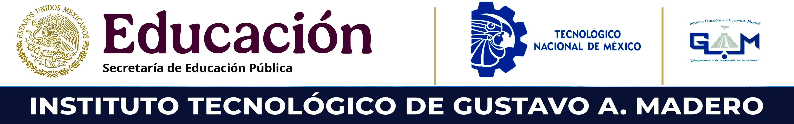

	

# Desarrollo Web SSR

Repositorio académico para la materia de Desarrollo Web SSR.

## 📚 Contenido

- Ramas de trabajo
- Proyecto eje de la materia

## 🎯 Objetivo

Documentar el proyecto del curso y concentrar en un solo lugar el desarrollo de actividades, prácticas y entregables.

## 🌿 Ramas del proyecto

- `dev`: rama de trabajo y desarrollo del profesor
- `main`: rama inicial
- `class-2026a`: rama de clase

## 😀 Convenciones de commits

| Código | Descripción |
|--------|-------------|
| feat: ✨ | Nueva funcionalidad |
| fix: 🐛 | Corrección de errores |
| docs: 📝 | Cambios en documentación |
| style: 🎨 | Cambios de formato (espacios, punto y coma, etc.) |
| refactor: ♻️ | Refactorización de código |
| perf: ⚡ | Mejoras de rendimiento |
| test: ✅ | Adición o modificación de tests |
| chore: 🔧 | Cambios en dependencias o configuración |
| ci: 🤖 | Cambios en CI/CD |
| revert: ⏮️ | Revertir un commit anterior |

**Ejemplo:** `feat: ✨ agregar autenticación de usuarios`

## 👤 Autor

- [Iván Rivalcoba](https://github.com/rivalcoba)